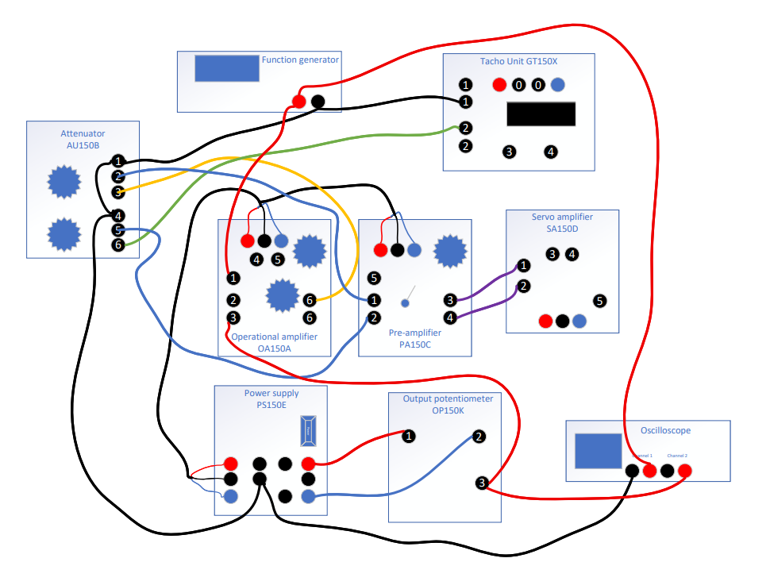

## Parameters

```matlab
ThetaD = 45; %rad

Ki = 4.8; %volt/rad

Ko = 4.8; %volt/rad

K1 = 1; %Set on attenuator

K2 = 0.3; %Set on attenuator

Kp = 10.2; %calculated in Lab 2

Km = 127.94;   %Motor properties constant = Vt/(Vin*Kt) calculated Lab 2

Kt = 0.026; %torque constant from lab 2

Tm = 0.250; %time constant from appendix
```

## Connection
