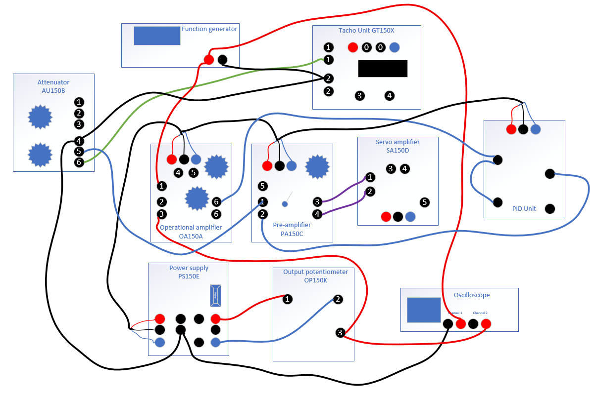
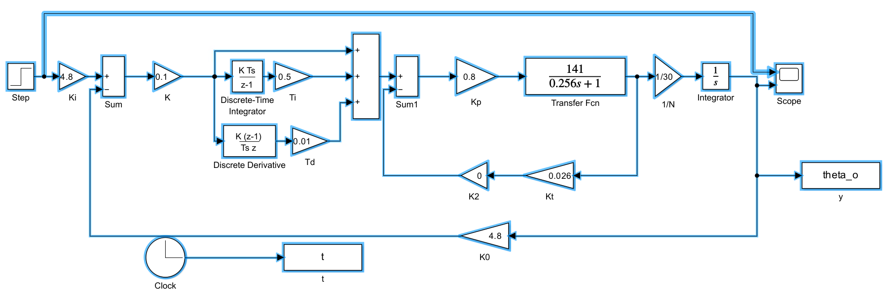

## Connections

## Transfer Function of PID controller

The transfer function on page 28 s not correct. It should be as below:

$$
G_c(s) = K(1+1/T_i s+sT_d)
$$

And the values for T_i and T_d are from experiments directly, no need to calculate them.

For example:

in one trial, $K = 0.1, T_i = 0.2, T_d = 0.3$, your transfer function of PID controller would be:

$$
G_c(s) = 0.1(1+1/0.2 s+0.3s)
$$

## Simulink Model

## EXP1 Q2 Q3 and Q4
Only need to do Root-locus, step response for one example from 4 steps, so 4 screenshots for each question. 