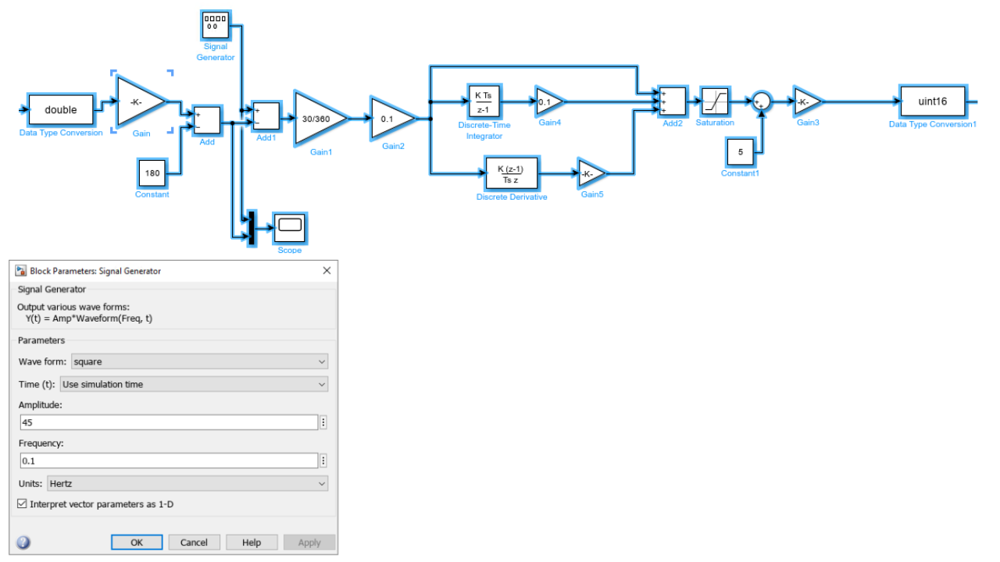

# Lab6

## Simulink model as shown on page 38
No need to add arduino related blocks before attending the lab.


To download an
[Example](https://github.com/AreteQin/MECH371/blob/main/Others/lab6_exp2_2019a.slx)

## SimuLink Model for EXP1
To download an
[Example](https://github.com/AreteQin/MECH371/blob/main/Others/lab6_exp1.slx)

## For EXP.2 Q1
```
k = 0.1;
Ti = 0.1;
Td = 0.2;
k2 = 0;
H = tf([105.6*k*Td 105.6*k 105.6*k*Ti],[3 (900*k2+30+105.6*k*Td) 105.6*k 105.6*k*Ti]); 
Hd = c2d(H,2,'foh');

step(H,'-',Hd,'--')
```

